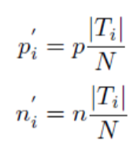
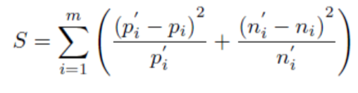

<h3>1. Clickstream Mining with Decision Trees</h3>
    
The project is based on a task posed in KDD Cup 2000. It involves mining click-stream data collected from Gazelle.com, which sells legware products. Your task is to determine: Given a set of page views, will the visitor view another page on the site or will he leave?

    
The data set given to you is in a different form than the original. In particular it has discretized numerical values obtained by partitioning them into 5 intervals of equal frequency. This way, we get a data set where for each feature, we have a finite set of values. These values are mapped to integers, so that the data is easier for you to handle

		<h4><u>Dataset</u></h4>
    
The data set can be downloaded from <code><a href="project05/clickstream-data.tar.gz">here</a></code>.

		
You have 5 files in .csv format

    <ol>
	  	<li><code>trainfeat.csv</code>: Contains 40000 examples, each with 274 features in the form of a 40000 x 274 matrix.</li>
	  	<li><code>trainlabs.csv</code>: Contains the labels (class) for each training example (did the visitor view another page?)</li>
	  	<li><code>testfeat.csv</code>: Contains 25000 examples, each with 274 features in the form of a 25000 x 274 matrix.</li>
			<li><code>testlabs.csv</code>: Contains the labels (class) for each testing example.</li>
			<li><code>featnames.csv</code>: Contains the "names" of the features. These might useful if you need to know what the features represent.</li>
  	</ol>
		
The format of the files is not complicated, just rows of integers separated by empty spaces.

		<h4>Stopping Criterion: Chi-squared criterion</h4>
		
What about split stopping? Suppose that the attribute that we want to split on is irrelevant. Then we would expect the positive and negative examples (labels 1 and 0) to be distributed according to a specific distribution. Suppose that splitting on attribute T, will produce sets <code>{T_i} where i = 1 to m</code>

		
Let p, n denote the number of positive and negative examples that we have in our dataset (not the whole set, the remaining one that we work on at this node). Let (N is the total number of examples in the current dataset):

		

		
be the expected number of positives and negatives in each partition, if the attribute is irrelevant to the class. Then the statistic of interest is:

		

		
where <code>p_i, n_i</code> are the positives and negatives in partition <code>T_i</code>. The main idea is that S is distributed (if the class is irrelevant) according to a chi-squared distribution with <code>m-1</code> degrees of freedom.

		
Now we must compute the p-value. This is the probability of observing a value X at least as extreme as S coming from the distribution. To find that, we compute <code>P(X >= S)</code>. The test is passed if the p-value is smaller than some threshold. Remember, the smallest that probability is, the more unlikely it is that S comes from a chi-squared distribution and consequently, that T is irrelevant to the class.

         
         

        Usage: python q1_classifier.py -p <pvalue> -f1 <train_dataset> -f2 <test_dataset> -o <output_file> -t <decision_tree>
		